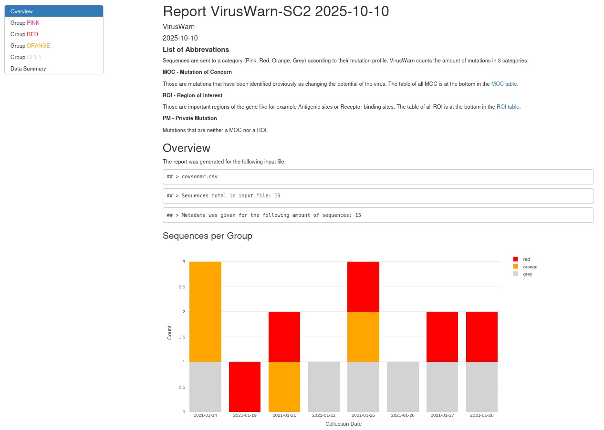
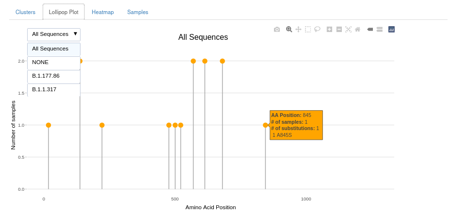
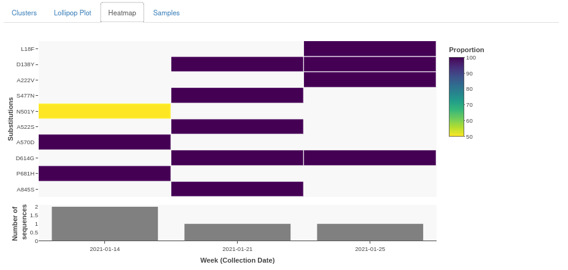
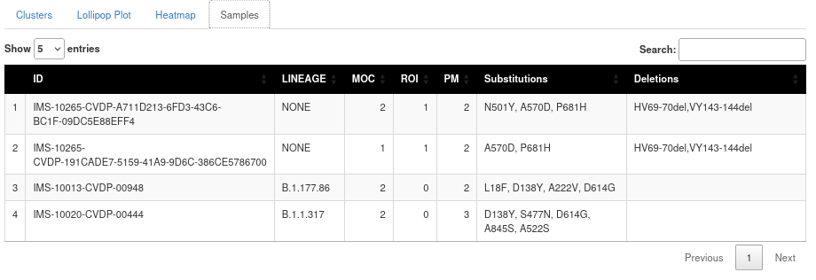
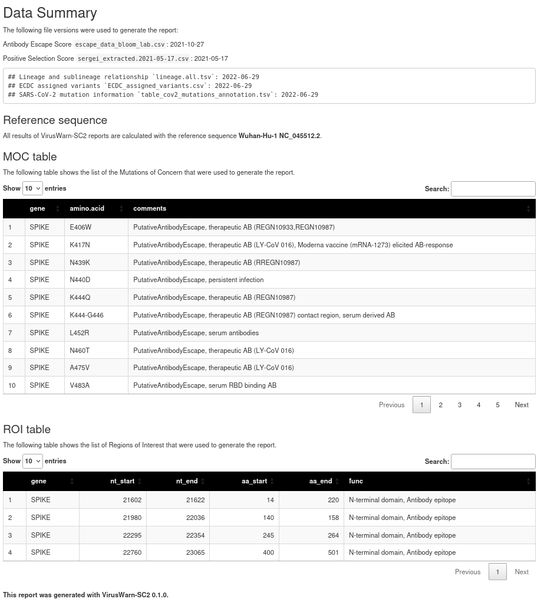

## Example reports

This folder includes two example reports that you can check out if you are curious about the output of VirusWarn-SC2.
You can also build them yourself.

For the report `example-report_covsonar.html`, please use:

```bash
nextflow run rki-mf1/viruswarn-sc2 -r <version> \
    -profile conda,local \
    --fasta 'test/covsonar.csv' --year 2021 \
    --covsonar
```

For the report `example-report_fasta.html`, please use:

```bash
nextflow run rki-mf1/viruswarn-sc2 -r <version> \
    -profile conda,local \
    --fasta 'test/sample-test.fasta' --year 2021 \
    --metadata 'test/meta.tsv' \
    --psl
```

## Screenshots

As GitHub does not show HTML files, you can find also some screenshots of the reports in the subfolder [`screenshots`](screenshots/). 

All of the plots in the report are interactive so it is definitely worth it to download the report or build one yourself to check out everything!
The example screenshots are taken from the covSonar report, that you can easily reproduce with the command above.

You can find the report overview with the barplot that shows how many samples from each week are placed in which level...



... the searchable table for all clusters grouped by VirusWarn of the level ...


... the lollipop plot from the level showing how many mutations occur at which position of the HA segment ...



... the heatmap of the level that shows if substitutions accumulated over the weeks ...



... the searchable table for all samples of the level ...



... and the overview of the data used to generate the results.

