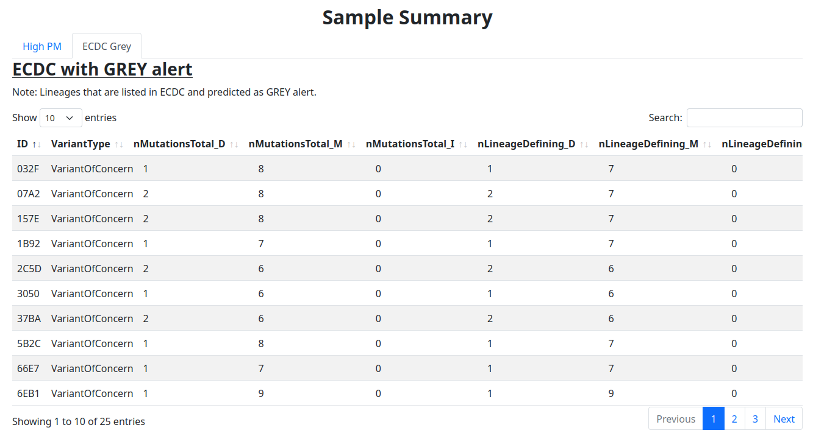

## Example reports

This folder includes two example reports that you can check out if you are curious about the output of VirusWarn-SC2.
You can also build them yourself.

For the report `example-report_covsonar.html`, please use:

```bash
nextflow run rki-mf1/viruswarn-sc2 -r <version> \
    -profile conda,local \
    --fasta 'test/covsonar.csv' --year 2021 \
    --covsonar
```

For the report `example-report_fasta.html`, please use:

```bash
nextflow run rki-mf1/viruswarn-sc2 -r <version> \
    -profile conda,local \
    --fasta 'test/sample-test.fasta' --year 2021 \
    --metadata 'test/meta.tsv' \
    --psl
```

## Screenshots

As GitHub does not show HTML files, you can find also some screenshots of the reports in the subfolder [`screenshots`](screenshots/).

You can find the report overview ...


... as well as the cluster summary from `example-report_covsonar.html` ...


... and the sample summary from `example-report_fasta.html`.

